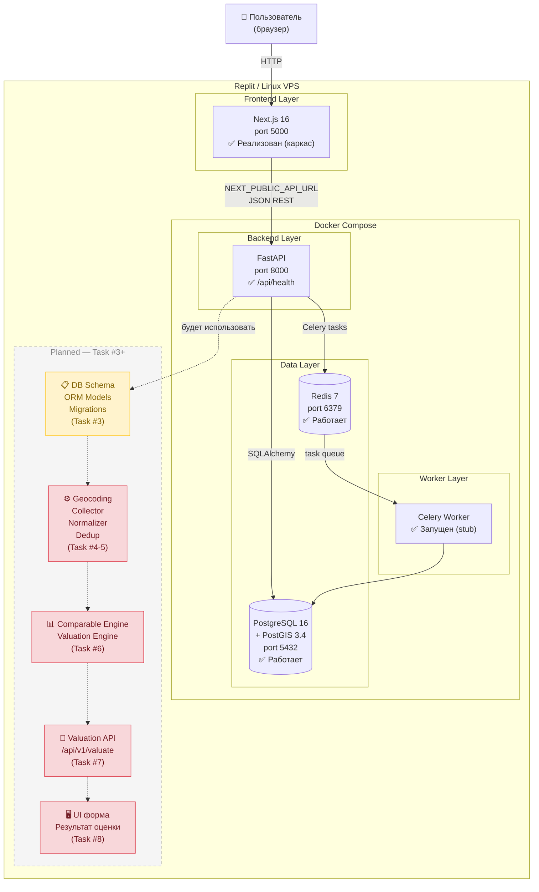

# Architecture Map — ОценитьКвартиру.рф

| Параметр | Значение |
|----------|---------|
| **Версия проекта** | v0.1 |
| **Дата** | 2026-08-21 |
| **Статус** | Foundation + Database Layer completed |
| **Отражает** | Текущее состояние проекта: инфраструктура + схема данных + миграции |
| **Следующий шаг** | Task #4 — Data Ingestion & Normalization |
---

## 1. Текущая инфраструктура

### Работающие сервисы

| Сервис | Технология | Image / Образ | Порт | Статус |
|--------|-----------|---------------|------|--------|
| **Frontend** | Next.js 16.3.2 + TypeScript + Tailwind CSS | `node:20-alpine` (build) | 5000 | ✅ Работает |
| **Backend API** | Python 3.12 + FastAPI 0.115.5 | `python:3.12-slim` (build) | 8000 | ✅ Работает |
| **Worker** | Celery 5.4.0 (тот же образ, что backend) | `python:3.12-slim` (build) | — | ✅ Работает |
| **Database** | PostgreSQL 16.4 + PostGIS 3.4.3 | `postgis/postgis:16-3.4` | 5432 | ✅ Работает |
| **Cache / Broker** | Redis 7 | `redis:7-alpine` | 6379 | ✅ Работает |

### Dev / Replit особенности

**Нативный запуск frontend в Replit.**
Контейнер `frontend` в `docker-compose.yml` существует, но в Replit **не запускается**. Вместо него Next.js запускается нативно в foreground-процессе Replit workflow:
```bash
docker compose up -d db redis backend worker --build
cd frontend && ([ -d node_modules ] || npm install) && npm run dev
```
Причина: Replit port-watcher обнаруживает только сокеты прямых дочерних процессов workflow; Docker NAT (`iptables`) невидим для watcher. На production Linux VPS `docker compose up` запускает все пять контейнеров, включая frontend.

**Healthcheck workaround.**
Блоки `healthcheck:` удалены из всех сервисов. `docker exec` (через который работают healthchecks) использует системный вызов `setns`, заблокированный в Replit sandbox. `depends_on` использует `condition: service_started`; гонка состояний компенсируется `restart: unless-stopped` на `backend` и `worker`.

**Production hardening — технический долг.**
Текущий compose-файл оптимизирован для dev/Replit. Для production необходимо: добавить healthchecks, убрать `--reload` из uvicorn, заменить bind mounts на запечённый в образ код, убрать небезопасные defaults, настроить публичный `NEXT_PUBLIC_API_URL`, выровнять `GEOCODING_PROVIDER` между сервисами, добавить сетевую изоляцию, закрыть порты DB/Redis от хоста. Полный список — [`docs/technical-debt.md`](technical-debt.md).

## Development vs Production Environment Strategy

### Текущая среда разработки

- Replit;
- Replit Managed PostgreSQL;
- совместимость с PostgreSQL 16;
- PostGIS;
- pgcrypto;
- SQLAlchemy;
- Alembic.

### Production стратегия

- PostgreSQL версии 16 или выше;
- PostGIS версии 3.x или выше;
- применение и версионирование схемы только через Alembic;
- перенос данных через `pg_dump`/`pg_restore` либо эквивалентный совместимый механизм.

### Архитектурные принципы

- приложение зависит от базы данных только через `DATABASE_URL`;
- продукт не зависит от Replit-specific API;
- Replit является dev-средой и инструментом разработки, а не runtime-компонентом продукта.

---

## 2. Поток данных

```
Пользователь
    │
    ▼ HTTP (браузер)
Next.js Frontend (port 5000)
    │
    ▼ JSON REST (NEXT_PUBLIC_API_URL)
FastAPI Backend (port 8000)
    ├──▶ PostgreSQL/PostGIS (port 5432)   ← хранение и выборка данных
    └──▶ Redis (port 6379)                ← брокер задач / очередь
              │
              ▼ Celery task queue
         Celery Worker
              ├──▶ Внешние источники данных   [Planned]
              ├──▶ Geocoding провайдер        [Planned]
              └──▶ PostgreSQL/PostGIS         ← запись нормализованных данных
```

**Результат оценки:**
```
PostgreSQL/PostGIS → FastAPI Backend → JSON response → Next.js Frontend → Пользователь
```

> **Граница реализации.** Стрелки выше описывают задуманную архитектуру полного MVP. Сейчас реализован только инфраструктурный слой: сервисы запущены, коммуникация между ними настроена, но прикладная логика (геокодирование, сбор данных, движки оценки, API endpoints) ещё не написана.

---

## 3. Взаимодействие Frontend / Backend

### Текущее (реализовано)

| Аспект | Состояние |
|--------|-----------|
| Health endpoint | `GET /api/health` → `{"status":"ok","service":"real-estate-analyzer","version":"1.0.0"}` |
| CORS | Middleware читает `CORS_ORIGINS` из env; дефолт: `http://localhost:5000,http://localhost:3000` |
| `NEXT_PUBLIC_API_URL` | Env-переменная для браузерного клиента; дефолт: `http://localhost:8000` |
| Swagger UI | `GET /docs` (автоматически из FastAPI) |

### Планируемое (не реализовано)

| Аспект | Описание |
|--------|---------|
| Основной API endpoint | `POST /api/v1/valuate` — синхронный запрос оценки |
| JSON API contract | Запрос: адрес, площадь, комнаты, этаж. Ответ: диапазон стоимости, медиана, цена за м², confidence score, список источников |
| Все денежные значения | В API — RUB (float), в БД — kopecks (BIGINT); конвертация только в Pydantic-схемах |

**Инвариант:** Frontend не обращается напрямую к PostgreSQL, Redis или Celery worker. Вся коммуникация — через FastAPI.

---

## 4. Будущие модули MVP

Основаны строго на спецификации `attached_assets/Pasted--MVP-v1-0--...txt` и task-документах `.local/tasks/`.

### Ingestion / Data Sources

| Модуль | Статус | Описание |
|--------|--------|---------|
| Source Adapter Interface | Planned | Единый интерфейс для всех источников данных недвижимости |
| MockAdapter | Planned | Заглушка-адаптер для разработки без реальных источников |
| Raw Listings Collector | Planned | Запрос данных через Source Adapters, сохранение в `raw_listings` |

### Нормализация / Дедупликация

| Модуль | Статус | Описание |
|--------|--------|---------|
| Listing Normalizer | Planned | Приведение сырых данных к единой схеме `listings` |
| Deduplication Engine | Planned | Выявление дублей; установка `duplicate_of_id` (строки не удаляются) |

### Геокодирование

| Модуль | Статус | Описание |
|--------|--------|---------|
| GeocodingProvider interface | Planned | Абстракция с тремя реализациями |
| MockProvider | Planned | Без сети; для dev |
| NominatimProvider | Planned | Бесплатный, без ключа |
| YandexProvider | Planned | Требует `YANDEX_GEOCODING_API_KEY` |

### Comparable Selection / Outlier Filtering

| Модуль | Статус | Описание |
|--------|--------|---------|
| Comparable Engine | Planned | Взвешенный similarity score: геопозиция, площадь, комнаты, этаж, тип здания |
| IQR Outlier Filter | Planned | Фильтрация по IQR на `asking_price_per_sqm`; множитель `IQR_MULTIPLIER=1.5` |

### Оценка стоимости

| Модуль | Статус | Описание |
|--------|--------|---------|
| Valuation Engine | Planned | `weighted_median_price_per_sqm × area`; диапазон P25–P75; confidence score |

### API

| Модуль | Статус | Описание |
|--------|--------|---------|
| `POST /api/v1/valuate` | Planned | Синхронный endpoint: geocode → collect → normalize → dedup → compare → valuate |
| Pydantic schemas (RUB) | Planned | Конвертация kopecks → RUB только в схемах ответа |

### Background Refresh Pipeline

| Модуль | Статус | Описание |
|--------|--------|---------|
| Celery Beat schedule | Planned | Периодическое обновление объявлений каждые 4 ч (`PIPELINE_REFRESH_INTERVAL_HOURS`) |
| `refresh_recent_locations` task | Stub | Заглушка присутствует в `backend/app/worker/tasks/refresh.py`; логика — Task #5 |

### UI / Result Presentation

| Модуль | Статус | Описание |
|--------|--------|---------|
| Форма ввода | Planned | Адрес, площадь, комнаты (Студия/1/2/3/4/5+), этаж |
| Результат оценки | Planned | Диапазон цен, медиана, цена за м², кол-во предложений, список источников |
| Confidence badge | Planned | «Надёжность оценки» — зелёный/жёлтый/красный; не статистический CI |
| SEO / метаданные | ✅ Реализовано | Title, description, OG-теги на русском в `layout.tsx` |
| Placeholder page | ✅ Реализовано | `page.tsx` — заглушка «Сервис в разработке» |

---

## 5. Границы Task #3 — Database Schema & Migrations

### Входные предпосылки от Task #2

- ✅ PostgreSQL 16 + PostGIS 3.4.3 запущен и доступен (проверено)
- ✅ `alembic==1.14.0` и `sqlalchemy==2.0.36` в `requirements.txt` и установлены в образе
- ✅ `psycopg2-binary==2.9.10` установлен
- ✅ `DATABASE_URL` сконфигурирован в `docker-compose.yml` для `backend` и `worker`
- ✅ База данных `realestate` создана, пользователь `app` имеет доступ
- ✅ Директория `backend/app/` готова для добавления `models/`

### Ожидаемые результаты Task #3

- `backend/alembic/` — инициализированная Alembic-конфигурация
- `backend/alembic/env.py` — читает `DATABASE_URL` из env; использует метаданные моделей
- `backend/app/models/base.py` — declarative base, `TimestampMixin`, `UUIDMixin`
- `backend/app/models/*.py` — ORM-модели для всех 9 таблиц (см. ниже)
- `backend/alembic/versions/<hash>_initial_schema.py` — начальная миграция
- `backend/scripts/seed.py` — вставка строки `sources` (MockAdapter)
- Все денежные колонки — `BIGINT` kopecks с комментарием в коде
- `duplicate_of_id` — nullable UUID FK `listings.id`
- PostGIS `geometry(Point, 4326)` на `buildings` и `listings`
- `CREATE EXTENSION IF NOT EXISTS postgis` выполняется до таблиц

**9 таблиц:** `sources`, `buildings`, `raw_listings`, `properties`, `listings`, `listing_price_history`, `search_requests`, `valuation_results`, `valuation_comparables`

### Явные исключения из Task #3

Task #3 **не включает** и не должен создавать:
- API business-endpoints (`/api/v1/valuate` и другие)
- Логику сбора данных / scraping / ingestion
- Реализацию geocoding-провайдеров
- Comparable Engine и Valuation Engine
- Celery production pipeline (расписание, реальные задачи)
- UI-компоненты формы и результата
- Авторизацию пользователей
- Production deployment configuration

### Техническое ограничение Replit для Task #3

`docker exec` заблокирован (`setns`). Запуск `alembic upgrade head` требует одной из альтернатив:
- **Entrypoint-скрипт** в `backend/Dockerfile` (рекомендуется): запускает `alembic upgrade head` перед `uvicorn`
- **`docker run --rm`**: `docker run --rm --network workspace_default workspace-backend alembic upgrade head`

---

## 6. Диаграмма компонентов



---

## 7. Архитектурные решения и открытые вопросы

### Принятые решения (зафиксированы)

| Решение | Обоснование |
|---------|-------------|
| Модульный монолит, не микросервисы | Явное требование ТЗ; достаточно для MVP; упрощает разработку solo-dev |
| Docker Compose для dev и production VPS | Единый инструмент; нет Kubernetes в MVP |
| Деньги хранятся в kopecks (BIGINT) | Исключает погрешности float; конвертация только в Pydantic-слое |
| Основной flow синхронный (`POST /api/v1/valuate`) | Целостность UX; Celery — только для фонового обновления данных |
| Дедупликация через `duplicate_of_id` (без удаления строк) | Сохраняет историю; обратимо |
| Outlier filter — IQR по `price_per_sqm`, не по абсолютной цене | Более справедливое сравнение разных площадей |
| Frontend запускается нативно в Replit | Обход ограничения port-watcher (Docker NAT невидим); подробнее — `docs/technical-debt.md` |
| `next@latest` → зафиксировано `16.3.2` в lockfile | `next@14.2.20` заблокирован Replit Package Firewall |

### Открытые вопросы

| Вопрос | Когда решать |
|--------|-------------|
| Стратегия запуска `alembic upgrade head` в Replit (entrypoint vs `docker run --rm`) | До начала Task #3 |
| Реальные источники данных: API-доступ, легальный способ получения | Task #5 — Source Adapters |
| Весовые коэффициенты Comparable Engine (geography / area / rooms / floor / building type) | Task #6 |
| Пороги confidence score (green/yellow/red) | Task #7–8 |
| Production compose override (отдельный `docker-compose.prod.yml`) | После завершения MVP |

### Ссылки

- Известные production risks и dev/prod различия → [`docs/technical-debt.md`](technical-debt.md)
- Оригинальное ТЗ → `attached_assets/Pasted--MVP-v1-0--1786819713082_1786819713083.txt`
- Task-спецификации → `.local/tasks/01-project-foundation.md` … `07-frontend.md`
- Replit-ограничения (healthchecks, ports, volumes) → `.agents/memory/docker-healthchecks.md`

## Development vs Production Environment Strategy

### Current Development Environment

The MVP is currently developed in Replit environment.

Infrastructure:

- Runtime: Replit
- Database: Replit Managed PostgreSQL
- Database engine: PostgreSQL 16 compatible
- Extensions:
  - PostGIS
  - pgcrypto
- ORM: SQLAlchemy
- Migration tool: Alembic

The application connects to the database only through DATABASE_URL.

No business logic depends on Replit-specific database features.

---

## Production Migration Strategy

Production environment should support:

- PostgreSQL >= 16
- PostGIS >= 3.x
- pgcrypto extension
- Alembic migrations
- SQLAlchemy compatibility

Migration process:

1. Provision production PostgreSQL cluster.
2. Enable required extensions.
3. Execute:
   ```bash
   alembic upgrade head
   ```
4. Transfer data using PostgreSQL native tools.
5. Update DATABASE_URL.

---

The application must not depend on:

- Replit-specific database APIs;
- Replit-only storage mechanisms;
- Replit-only execution workflows;
- environment-specific networking assumptions.

Replit is considered a development platform, not an application dependency.