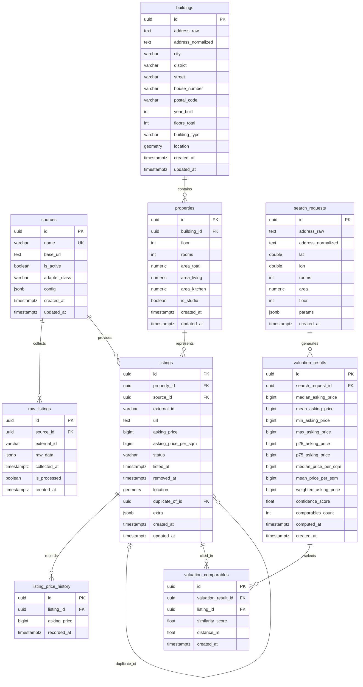

# Database Design — ОценитьКвартиру.рф

| Параметр | Значение |
|----------|---------|
| **Версия дизайна** | v0.1 |
| **Статус** | Design Proposal — предшествует Task #3 |
| **Таблицы существуют** | Нет. Ни одна таблица не создана. |
| **Дата** | 2026-08-21 |
| **Архитектурный контекст** | [`docs/architecture-map.md`](architecture-map.md) |
| **Технический долг** | [`docs/technical-debt.md`](technical-debt.md) |

---

## 11. Границы документа (читать первым)

Этот документ — **проектное предложение**, а не migration plan и не реализация.

- Никаких таблиц, ORM-моделей, SQL DDL, Alembic-конфигурации или миграций здесь нет и не будет — они создаются в Task #3.
- Документ описывает _намерение_: структуру, типы, индексы, связи и спорные решения.
- Все упомянутые сущности помечены статусом **[Planned]**.
- После принятия решений из раздела 10 этот документ служит техническим заданием для Task #3.

---

## 1. ER-модель

> Все сущности — **[Planned]**. Таблицы не существуют.



---

## 2. Назначение таблиц

| Таблица | Назначение |
|---------|-----------|
| `sources` | Реестр источников данных. Каждый Source Adapter регистрируется здесь. Служит точкой конфигурации и audit trail происхождения объявлений. |
| `buildings` | Нормализованные физические объекты недвижимости (дома). Несколько объявлений из разных источников могут ссылаться на один `building`. Содержит геолокацию здания. |
| `raw_listings` | Буфер сырых данных из источников. Хранит оригинальный JSON-payload нетронутым. После нормализации помечается `is_processed = true`. Обеспечивает аудитность и возможность повторной нормализации. |
| `properties` | Конкретная квартира/юнит внутри здания: этаж, количество комнат, площади. Промежуточный слой между зданием и объявлением. |
| `listings` | Центральная таблица: объявление о продаже/аренде. Содержит цену, статус, ссылку на источник и свойство. Дубликаты помечаются `duplicate_of_id`, но не удаляются. |
| `listing_price_history` | Хронология изменений цены для конкретного объявления. Создаётся при каждом обновлении `asking_price`. |
| `search_requests` | Параметры каждого пользовательского запроса оценки. Служит как anchor для Valuation Result и как список адресов для периодического Celery-refresh. |
| `valuation_results` | Результат оценки: набор статистик в kopecks. Привязан к одному `search_request`. Snapshot на момент вычисления. |
| `valuation_comparables` | Объявления, использованные в конкретной оценке, с индивидуальными оценками схожести. Обеспечивает воспроизводимость и аудитность оценки. |

---

## 3. Полная спецификация полей

> Все типы и семантика — **[Planned]**. Финальные типы фиксируются в Decision Checklist (раздел 10) перед Task #3.

### `sources`

| Поле | Предлагаемый тип PostgreSQL | NULL | Default | Назначение |
|------|-----------------------------|------|---------|-----------|
| `id` | `UUID` | NOT NULL | `gen_random_uuid()` | PK |
| `name` | `VARCHAR(100)` | NOT NULL | — | Человекочитаемое имя источника (уникальное) |
| `base_url` | `TEXT` | NULL | — | Базовый URL сайта-источника |
| `is_active` | `BOOLEAN` | NOT NULL | `true` | Флаг активности; неактивные источники не опрашиваются |
| `adapter_class` | `VARCHAR(200)` | NOT NULL | — | Python fully-qualified class name адаптера |
| `config` | `JSONB` | NULL | `'{}'` | Конфигурация, специфичная для адаптера (timeout, headers и т.п.) |
| `created_at` | `TIMESTAMPTZ` | NOT NULL | `now()` | Время создания записи |
| `updated_at` | `TIMESTAMPTZ` | NOT NULL | `now()` | Время последнего обновления |

---

### `buildings`

| Поле | Тип | NULL | Default | Назначение |
|------|-----|------|---------|-----------|
| `id` | `UUID` | NOT NULL | `gen_random_uuid()` | PK |
| `address_raw` | `TEXT` | NOT NULL | — | Оригинальный адрес, как пришёл из источника |
| `address_normalized` | `TEXT` | NULL | — | Нормализованный адрес после геокодирования |
| `city` | `VARCHAR(100)` | NULL | — | Город |
| `district` | `VARCHAR(200)` | NULL | — | Район/округ |
| `street` | `VARCHAR(200)` | NULL | — | Улица |
| `house_number` | `VARCHAR(20)` | NULL | — | Номер дома (с литерой, корпусом) |
| `postal_code` | `VARCHAR(10)` | NULL | — | Почтовый индекс |
| `year_built` | `SMALLINT` | NULL | — | Год постройки |
| `floors_total` | `SMALLINT` | NULL | — | Количество этажей в доме |
| `building_type` | `VARCHAR(20)` | NULL | — | Тип дома: `panel`, `brick`, `monolith`, `other` — enum или CHECK |
| `location` | `geometry(Point, 4326)` | NULL | — | Координаты здания (PostGIS); nullable: геокодирование может не дать результата |
| `created_at` | `TIMESTAMPTZ` | NOT NULL | `now()` | |
| `updated_at` | `TIMESTAMPTZ` | NOT NULL | `now()` | |

---

### `raw_listings`

| Поле | Тип | NULL | Default | Назначение |
|------|-----|------|---------|-----------|
| `id` | `UUID` | NOT NULL | `gen_random_uuid()` | PK |
| `source_id` | `UUID` | NOT NULL | — | FK → `sources.id` |
| `external_id` | `VARCHAR(200)` | NOT NULL | — | Идентификатор объявления в системе источника |
| `raw_data` | `JSONB` | NOT NULL | — | Полный оригинальный payload от источника (неизменяем после записи) |
| `collected_at` | `TIMESTAMPTZ` | NOT NULL | `now()` | Время сбора данных |
| `is_processed` | `BOOLEAN` | NOT NULL | `false` | Флаг: нормализовано ли объявление в `listings` |
| `created_at` | `TIMESTAMPTZ` | NOT NULL | `now()` | |

---

### `properties`

| Поле | Тип | NULL | Default | Назначение |
|------|-----|------|---------|-----------|
| `id` | `UUID` | NOT NULL | `gen_random_uuid()` | PK |
| `building_id` | `UUID` | NOT NULL | — | FK → `buildings.id` |
| `floor` | `SMALLINT` | NULL | — | Этаж квартиры |
| `rooms` | `SMALLINT` | NOT NULL | — | Количество комнат; `0` = студия |
| `area_total` | `NUMERIC(8,2)` | NOT NULL | — | Общая площадь, м² |
| `area_living` | `NUMERIC(8,2)` | NULL | — | Жилая площадь, м² |
| `area_kitchen` | `NUMERIC(8,2)` | NULL | — | Площадь кухни, м² |
| `is_studio` | `BOOLEAN` | NOT NULL | `false` | Явный флаг студии (дублирует `rooms = 0` для читаемости) |
| `created_at` | `TIMESTAMPTZ` | NOT NULL | `now()` | |
| `updated_at` | `TIMESTAMPTZ` | NOT NULL | `now()` | |

---

### `listings`

> Центральная таблица. Строки **никогда не удаляются**. Дубликаты помечаются `duplicate_of_id`.  
> Все денежные поля — **BIGINT в kopecks** (1 RUB = 100 kopecks). Конвертация только в Pydantic API-слое.

| Поле | Тип | NULL | Default | Назначение |
|------|-----|------|---------|-----------|
| `id` | `UUID` | NOT NULL | `gen_random_uuid()` | PK |
| `property_id` | `UUID` | NOT NULL | — | FK → `properties.id` |
| `source_id` | `UUID` | NOT NULL | — | FK → `sources.id` |
| `external_id` | `VARCHAR(200)` | NOT NULL | — | ID объявления в системе источника |
| `url` | `TEXT` | NULL | — | Прямая ссылка на объявление |
| `asking_price` | `BIGINT` | NOT NULL | — | **Запрашиваемая цена, kopecks.** Цена продавца, не подтверждённая сделка. |
| `asking_price_per_sqm` | `BIGINT` | NOT NULL | — | **Цена за м², kopecks.** = `asking_price / area_total` (вычисляется при нормализации). |
| `status` | `VARCHAR(10)` | NOT NULL | `'active'` | Состояние объявления: `active`, `sold`, `removed` |
| `listed_at` | `TIMESTAMPTZ` | NULL | — | Дата публикации объявления (по данным источника) |
| `removed_at` | `TIMESTAMPTZ` | NULL | — | Дата снятия объявления (NULL, если ещё активно) |
| `location` | `geometry(Point, 4326)` | NULL | — | Координаты объявления (может отличаться от `buildings.location`) |
| `duplicate_of_id` | `UUID` | NULL | — | FK → `listings.id`; указывает на каноническое объявление. NULL = не дубликат. |
| `extra` | `JSONB` | NULL | `'{}'` | Дополнительные атрибуты, специфичные для источника |
| `created_at` | `TIMESTAMPTZ` | NOT NULL | `now()` | |
| `updated_at` | `TIMESTAMPTZ` | NOT NULL | `now()` | |

---

### `listing_price_history`

| Поле | Тип | NULL | Default | Назначение |
|------|-----|------|---------|-----------|
| `id` | `UUID` | NOT NULL | `gen_random_uuid()` | PK |
| `listing_id` | `UUID` | NOT NULL | — | FK → `listings.id` |
| `asking_price` | `BIGINT` | NOT NULL | — | Зафиксированная цена в kopecks на момент записи |
| `recorded_at` | `TIMESTAMPTZ` | NOT NULL | `now()` | Время фиксации цены |

---

### `search_requests`

| Поле | Тип | NULL | Default | Назначение |
|------|-----|------|---------|-----------|
| `id` | `UUID` | NOT NULL | `gen_random_uuid()` | PK |
| `address_raw` | `TEXT` | NOT NULL | — | Адрес в виде пользователя |
| `address_normalized` | `TEXT` | NULL | — | Нормализованный адрес после геокодирования |
| `lat` | `DOUBLE PRECISION` | NULL | — | Широта (результат геокодирования) |
| `lon` | `DOUBLE PRECISION` | NULL | — | Долгота |
| `rooms` | `SMALLINT` | NOT NULL | — | Количество комнат (0 = студия) |
| `area` | `NUMERIC(8,2)` | NOT NULL | — | Площадь, м² |
| `floor` | `SMALLINT` | NULL | — | Этаж |
| `params` | `JSONB` | NULL | `'{}'` | Прочие параметры запроса (расширяемость) |
| `created_at` | `TIMESTAMPTZ` | NOT NULL | `now()` | Используется Celery для определения «недавних» локаций |

---

### `valuation_results`

> Все денежные поля — **BIGINT в kopecks**. `source_count` не хранится — вычисляется на лету через `COUNT(DISTINCT source_id)` по `valuation_comparables → listings`.

| Поле | Тип | NULL | Default | Назначение |
|------|-----|------|---------|-----------|
| `id` | `UUID` | NOT NULL | `gen_random_uuid()` | PK |
| `search_request_id` | `UUID` | NOT NULL | — | FK → `search_requests.id` |
| `median_asking_price` | `BIGINT` | NOT NULL | — | Медианная цена по comparables, kopecks |
| `mean_asking_price` | `BIGINT` | NOT NULL | — | Средняя цена, kopecks |
| `min_asking_price` | `BIGINT` | NOT NULL | — | Минимальная цена, kopecks (вторичная статистика) |
| `max_asking_price` | `BIGINT` | NOT NULL | — | Максимальная цена, kopecks (вторичная статистика) |
| `p25_asking_price` | `BIGINT` | NOT NULL | — | 25-й перцентиль, kopecks (граница диапазона) |
| `p75_asking_price` | `BIGINT` | NOT NULL | — | 75-й перцентиль, kopecks (граница диапазона) |
| `median_price_per_sqm` | `BIGINT` | NOT NULL | — | Медианная цена за м², kopecks |
| `mean_price_per_sqm` | `BIGINT` | NOT NULL | — | Средняя цена за м², kopecks |
| `weighted_asking_price` | `BIGINT` | NOT NULL | — | **Основная оценка**: `weighted_median_price_per_sqm × area`, kopecks |
| `confidence_score` | `DOUBLE PRECISION` | NOT NULL | — | Внутренний score 0.0–1.0; в UI отображается как цветовой badge |
| `comparables_count` | `INTEGER` | NOT NULL | — | Количество использованных объявлений (после IQR-фильтра) |
| `computed_at` | `TIMESTAMPTZ` | NOT NULL | `now()` | Момент вычисления оценки |
| `created_at` | `TIMESTAMPTZ` | NOT NULL | `now()` | |

---

### `valuation_comparables`

| Поле | Тип | NULL | Default | Назначение |
|------|-----|------|---------|-----------|
| `id` | `UUID` | NOT NULL | `gen_random_uuid()` | PK |
| `valuation_result_id` | `UUID` | NOT NULL | — | FK → `valuation_results.id` |
| `listing_id` | `UUID` | NOT NULL | — | FK → `listings.id`; ссылка на объявление в момент оценки |
| `similarity_score` | `DOUBLE PRECISION` | NOT NULL | — | Взвешенный score схожести, 0.0–1.0 |
| `distance_m` | `DOUBLE PRECISION` | NULL | — | Расстояние до объекта оценки, метры |
| `created_at` | `TIMESTAMPTZ` | NOT NULL | `now()` | |

---

## 4. Primary Keys

| Таблица | PK | Тип | Обоснование |
|---------|-----|-----|-------------|
| `sources` | `id` | UUID | Глобальная уникальность без координации; безопасен для будущей федерации |
| `buildings` | `id` | UUID | То же |
| `raw_listings` | `id` | UUID | То же |
| `properties` | `id` | UUID | То же |
| `listings` | `id` | UUID | То же; упрощает self-reference `duplicate_of_id` |
| `listing_price_history` | `id` | UUID | То же |
| `search_requests` | `id` | UUID | То же |
| `valuation_results` | `id` | UUID | То же |
| `valuation_comparables` | `id` | UUID | То же |

> ⚠️ UUID vs BIGINT SERIAL — спорный вопрос; см. Decision Checklist (раздел 10).

---

## 5. Foreign Keys и правила ON DELETE / ON UPDATE

| FK | Таблица.поле → ссылается на | ON DELETE | ON UPDATE | Обоснование |
|----|----------------------------|-----------|-----------|-------------|
| FK1 | `raw_listings.source_id` → `sources.id` | `RESTRICT` | `CASCADE` | Нельзя удалить источник, имеющий собранные данные |
| FK2 | `properties.building_id` → `buildings.id` | `RESTRICT` | `CASCADE` | Нельзя удалить здание с квартирами |
| FK3 | `listings.property_id` → `properties.id` | `RESTRICT` | `CASCADE` | Нельзя удалить квартиру с объявлениями |
| FK4 | `listings.source_id` → `sources.id` | `RESTRICT` | `CASCADE` | Нельзя удалить источник с объявлениями |
| FK5 | `listings.duplicate_of_id` → `listings.id` | `SET NULL` | `CASCADE` | Если «оригинал» гипотетически удалён — дубликат становится самостоятельным |
| FK6 | `listing_price_history.listing_id` → `listings.id` | `CASCADE` | `CASCADE` | История цены без объявления лишена смысла; но т.к. listings не удаляются, CASCADE носит защитный характер |
| FK7 | `valuation_results.search_request_id` → `search_requests.id` | `RESTRICT` | `CASCADE` | Поисковый запрос нужен для Celery refresh; удаление заблокировано наличием результата |
| FK8 | `valuation_comparables.valuation_result_id` → `valuation_results.id` | `CASCADE` | `CASCADE` | Comparables без результата оценки бессмысленны; каскадное удаление при очистке |
| FK9 | `valuation_comparables.listing_id` → `listings.id` | `RESTRICT` | `CASCADE` | Нельзя удалить объявление, использованное в оценке |

> `RESTRICT` означает «отказать в удалении, если существуют зависимые строки».  
> `ON UPDATE CASCADE` на UUID-PK практически никогда не срабатывает, но задаётся для полноты.

---

## 6. Индексы

> Указаны только обоснованные индексы. «Бесплатных» индексов нет — каждый замедляет INSERT/UPDATE.

### `sources`

| Индекс | Тип | Поля | Назначение |
|--------|-----|------|-----------|
| PK | BTREE | `id` | Auto |
| UQ | BTREE | `name` | Уникальность имени источника |
| IDX | BTREE | `is_active` | Быстрый выбор активных источников при запуске коллектора |

### `buildings`

| Индекс | Тип | Поля | Назначение |
|--------|-----|------|-----------|
| PK | BTREE | `id` | Auto |
| IDX_GEO | GIST | `location` | Spatial queries в ComparableEngine (`ST_DWithin`, `ST_Distance`) |
| IDX | BTREE | `city` | Фильтрация по городу при поиске похожих зданий |

### `raw_listings`

| Индекс | Тип | Поля | Назначение |
|--------|-----|------|-----------|
| PK | BTREE | `id` | Auto |
| UQ | BTREE | `(source_id, external_id)` | Предотвращение повторного сбора того же объявления |
| IDX | BTREE | `is_processed, collected_at` | Composite: быстрый выбор необработанных объявлений для нормализации; `collected_at` для упорядочивания |

### `properties`

| Индекс | Тип | Поля | Назначение |
|--------|-----|------|-----------|
| PK | BTREE | `id` | Auto |
| IDX | BTREE | `building_id` | FK lookup |
| IDX | BTREE | `(rooms, area_total)` | Composite: поиск схожих квартир по комнатам и площади в ComparableEngine |

### `listings`

| Индекс | Тип | Поля | Назначение |
|--------|-----|------|-----------|
| PK | BTREE | `id` | Auto |
| UQ | BTREE | `(source_id, external_id)` | Каноническая идентичность объявления внутри источника |
| IDX_GEO | GIST | `location` | Spatial lookup в ComparableEngine (`ST_DWithin` для радиуса поиска) |
| IDX_STATUS | BTREE | `status` | Фильтрация активных объявлений |
| PARTIAL | BTREE | `id WHERE duplicate_of_id IS NULL` | Partial index: только неудалённые и неповторяющиеся — именно этот набор запрашивает ComparableEngine |
| IDX | BTREE | `listed_at` | Сортировка по дате; Celery refresh выбирает недавние |
| IDX | BTREE | `property_id` | FK lookup |
| IDX | BTREE | `duplicate_of_id` WHERE NOT NULL | Поиск всех дубликатов конкретного объявления |

### `listing_price_history`

| Индекс | Тип | Поля | Назначение |
|--------|-----|------|-----------|
| PK | BTREE | `id` | Auto |
| IDX | BTREE | `(listing_id, recorded_at DESC)` | Composite: хронологический ряд цен для конкретного объявления |

### `search_requests`

| Индекс | Тип | Поля | Назначение |
|--------|-----|------|-----------|
| PK | BTREE | `id` | Auto |
| IDX | BTREE | `created_at DESC` | Celery refresh: выбор недавних локаций (`ORDER BY created_at DESC LIMIT N`) |

### `valuation_results`

| Индекс | Тип | Поля | Назначение |
|--------|-----|------|-----------|
| PK | BTREE | `id` | Auto |
| IDX | BTREE | `search_request_id` | FK lookup; загрузка результатов по запросу |
| IDX | BTREE | `computed_at DESC` | Получение последней оценки по запросу |

### `valuation_comparables`

| Индекс | Тип | Поля | Назначение |
|--------|-----|------|-----------|
| PK | BTREE | `id` | Auto |
| IDX | BTREE | `valuation_result_id` | FK lookup; загрузка всех comparables оценки |
| IDX | BTREE | `listing_id` | Проверка: в каких оценках использовалось объявление (audit) |

---

## 7. PostGIS — детали использования

### Геометрические поля

| Таблица | Поле | Тип | SRID | Nullable | Назначение |
|---------|------|-----|------|----------|-----------|
| `buildings` | `location` | `geometry(Point, 4326)` | 4326 (WGS84) | ДА | Координаты здания, результат геокодирования адреса |
| `listings` | `location` | `geometry(Point, 4326)` | 4326 (WGS84) | ДА | Координаты объявления (может быть точнее, чем здание) |

**Почему `geometry`, а не `geography`** — предмет Decision Checklist (п. 10). Краткое обоснование: `geometry` быстрее при индексировании, `geography` точнее для больших расстояний. Для городских запросов (< 10 км) разница пренебрежима.

**Почему SRID 4326 (WGS84):** стандарт GPS / веб-картографии; Nominatim и Yandex Geocoder возвращают lat/lon именно в этой системе. Не требует перепроецирования при сохранении.

**Nullable:** геокодирование может завершиться неудачей (адрес не найден, внешний сервис недоступен). Система должна корректно работать с объявлением без координат, исключая его из spatial-запросов ComparableEngine.

### Spatial queries (планируемые)

| Запрос | Функция PostGIS | Применение |
|--------|----------------|-----------|
| Radius filter | `ST_DWithin(location, target_point, radius_meters)` | ComparableEngine: выбор объявлений в радиусе от целевого адреса |
| Distance calculation | `ST_Distance(location, target_point)` | Компонент similarity score; значение в `valuation_comparables.distance_m` |
| Point creation | `ST_MakePoint(lon, lat)::geometry` | Создание точки из результата геокодирования |
| SRID set | `ST_SetSRID(point, 4326)` | Явная привязка к WGS84 при вставке |

### `CREATE EXTENSION`

`CREATE EXTENSION IF NOT EXISTS postgis;` должен выполняться до всех DDL-операций в начальной миграции Alembic.

> ⚠️ Кто владеет расширением? Пользователь `app` или superuser? — см. Decision Checklist, п. 14.

---

## 8. Поток данных: Source → Raw Listing → Listing → Comparable → Valuation

```
┌─────────────┐
│  sources    │  ← Реестр источников; создаётся seed-скриптом Task #3
└──────┬──────┘
       │ Celery Worker вызывает Source Adapter
       ▼
┌─────────────────┐
│  raw_listings   │  ← Сырой JSON-payload; is_processed = false
│  (source_id,    │     UNIQUE(source_id, external_id) предотвращает
│   external_id,  │     повторный сбор того же объявления
│   raw_data JSONB│
│   is_processed) │
└──────┬──────────┘
       │ Normalizer читает WHERE is_processed = false
       ▼
┌──────────────┐    ┌────────────────┐
│  buildings   │←───│  properties    │
│  (location   │    │  (building_id, │
│   geometry)  │    │   rooms, area) │
└──────────────┘    └───────┬────────┘
                            │
                            ▼
┌─────────────────────────────────────────────────────────────┐
│  listings                                                   │
│  (asking_price BIGINT kopecks,                             │
│   asking_price_per_sqm BIGINT kopecks,                     │
│   status, location geometry,                               │
│   duplicate_of_id — NULL = канонический)                   │
└──────┬──────────────────────────┬──────────────────────────┘
       │                          │
       │ Дедупликация             │ Celery: изменение цены →
       │ (если дубль найден →     ▼
       │  duplicate_of_id ≠ NULL) ┌────────────────────┐
       │                          │ listing_price_history│
       │                          └────────────────────┘
       │
       │ ComparableEngine запрашивает:
       │ WHERE duplicate_of_id IS NULL AND status = 'active'
       │   AND ST_DWithin(location, target, radius)
       │   AND rooms = target_rooms
       │   AND area_total BETWEEN ...
       │ → применяет IQR-фильтр по asking_price_per_sqm
       │ → вычисляет similarity_score
       ▼
┌────────────────────┐        ┌───────────────────────────┐
│ search_requests    │───────▶│  valuation_results        │
│ (адрес, комнаты,  │        │  (weighted_asking_price,  │
│  площадь, этаж)   │        │   p25/p75, confidence,    │
└────────────────────┘        │   comparables_count)      │
                              └───────────────┬───────────┘
                                              │
                                              ▼
                              ┌───────────────────────────┐
                              │ valuation_comparables     │
                              │ (listing_id,              │
                              │  similarity_score,        │
                              │  distance_m)              │
                              └───────────────────────────┘
```

### Lineage и auditability

| Стадия | Auditability |
|--------|-------------|
| Raw → Listing | `raw_listings.id` сохраняется; при повторной нормализации данные всегда доступны |
| Listing origin | `listings.source_id + external_id` идентифицирует источник |
| Price changes | `listing_price_history` хранит полную историю |
| Deduplication | `duplicate_of_id` указывает на оригинал; оба объявления сохранены |
| Valuation snapshot | `valuation_comparables` фиксирует список объявлений на момент оценки; `listing_id` позволяет проследить состояние объявления |
| Source diversity | `source_count` вычисляется на лету: `COUNT(DISTINCT l.source_id) FROM valuation_comparables vc JOIN listings l ON l.id = vc.listing_id WHERE vc.valuation_result_id = ?` |

---

## 9. Потенциальные проблемы модели

| # | Проблема | Описание | Предлагаемое смягчение |
|---|----------|----------|----------------------|
| 1 | **Дубликаты** | Одно объявление может появиться в нескольких источниках или повторно в том же источнике с другим `external_id` | `UNIQUE(source_id, external_id)` предотвращает дубли внутри источника; межисточниковые дубли обрабатывает Deduplication Engine через `duplicate_of_id` |
| 2 | **Изменчивость цены** | Цена объявления может измениться между циклами обновления | `listing_price_history` фиксирует каждое изменение; `asking_price` в `listings` — всегда актуальная цена |
| 3 | **Адресная нормализация** | «ул. Ленина, 5» и «Ленина ул., д.5» — один адрес; `buildings` может содержать дубли | Геокодирование по координатам + proximity dedup зданий; поле `address_normalized` для текстового сравнения |
| 4 | **Nullable geo** | Геокодирование может не дать результата; объявление без координат не участвует в spatial-запросах | Сохранять как NULL; исключить из ComparableEngine без ошибки; мониторить долю null |
| 5 | **Точность денег** | `asking_price / area_total` (kopecks / м²) даёт целочисленное деление с потерей | Вычислять `asking_price_per_sqm` на уровне приложения с округлением; хранить как BIGINT |
| 6 | **Временна́я согласованность** | Оценка использует текущие данные; прошлые оценки не воспроизводимы если объявления изменились | `valuation_comparables` фиксирует `listing_id` на момент оценки, но не значения полей listing; snapshot объявлений не хранится |
| 7 | **Воспроизводимость comparable** | При повторном запросе той же оценки результат может отличаться | Принять как допустимое свойство системы; при необходимости — хранить snapshot в JSONB в `valuation_results` |
| 8 | **Выбросы** | После IQR-фильтра может остаться < 5 объявлений; `confidence_score` должен это отражать | Пропустить IQR если < 5 после фильтрации; `confidence_score` коррелирует с `comparables_count` |
| 9 | **Provider identifiers** | `external_id` уникален только внутри `source_id`; смена источника сбрасывает историю | UNIQUE по `(source_id, external_id)`; межисточниковое связывание — через Dedup Engine |
| 10 | **Raw payload retention** | `raw_listings.raw_data` (JSONB) может занимать значительное место | Определить TTL/retention policy; после нормализации `raw_data` может быть обнулён или архивирован |
| 11 | **Privacy / licensing** | `raw_data` может содержать персональные данные (ФИО продавца, телефон) | Не хранить PII в `raw_data` или применять маскировку при нормализации; уточнить лицензию источника |
| 12 | **Производительность** | Spatial + многоколоночные фильтры на больших наборах данных | GIST на `location`, partial index на `duplicate_of_id IS NULL`, составной индекс по `(rooms, area_total)`; мониторить EXPLAIN ANALYZE |

---

## 10. Решения, которые нужно принять до Alembic migration

> **Decision Checklist** — каждый пункт должен быть явно согласован перед Task #3. Молчаливая фиксация недопустима.

| # | Вопрос | Варианты | Рекомендация / Комментарий |
|---|--------|----------|---------------------------|
| 1 | **UUID vs BIGINT SERIAL** для PK | `gen_random_uuid()` (UUID v4) / `BIGINT GENERATED ALWAYS AS IDENTITY` | UUID: глобальная уникальность, сложнее pagination. BIGINT: компактнее, быстрее JOIN. Для MVP с одним инстансом оба приемлемы. |
| 2 | **`geometry` vs `geography`** (PostGIS) | `geometry(Point, 4326)` / `geography(Point, 4326)` | `geometry`: быстрее, требует `ST_DWithin` с метрами через `ST_Distance_Sphere`. `geography`: встроенные метры, медленнее. Для радиуса < 50 км разница пренебрежима; рекомендуется `geometry` с явным SRID 4326. |
| 3 | **Каноническая идентичность объявления** | `(source_id, external_id)` / hash(url) / content hash | UNIQUE по `(source_id, external_id)` — наиболее надёжный; URL-дубли ловит Dedup Engine. |
| 4 | **Представление истории цен** | Отдельная таблица `listing_price_history` / JSONB-массив в `listings` / append-only версии строк | Отдельная таблица — наиболее нормализованный вариант; JSONB проще но нет индексирования. |
| 5 | **Адресная модель** | Плоские поля `city, street, house_number` / единое поле `address_normalized` / вложенный JSONB | Плоские поля + `address_normalized` — баланс нормализации и читаемости. |
| 6 | **Enum vs CHECK constraints vs lookup table** | PostgreSQL ENUM / VARCHAR + CHECK / отдельная таблица | ENUM: жёстко, требует миграции для нового значения. CHECK: гибко. Lookup table: максимум гибкости. Рекомендуется: VARCHAR + CHECK для MVP, переход на ENUM позже. |
| 7 | **Raw payload JSONB retention** | Хранить вечно / обнулять после нормализации / TTL по `collected_at` | Определить явно: объём `raw_data` может расти неограниченно. |
| 8 | **Snapshot immutability valuation_comparables** | Только `listing_id` (ссылка на живые данные) / JSONB-snapshot значений listing на момент оценки | `listing_id` достаточно для MVP; snapshot нужен только если требуется точное воспроизведение. |
| 9 | **Политика удаления** | Никогда не удалять (soft delete через `status`) / физическое удаление с архивом / TTL | Для `listings` — никогда не удалять (зафиксировано). Для `raw_listings`, `search_requests`, `valuation_results` — определить TTL. |
| 10 | **Timestamps и timezone** | `TIMESTAMPTZ` везде (UTC) / `TIMESTAMP` + explicit conversion | Только `TIMESTAMPTZ`. Celery timezone = `Europe/Moscow` (в `celery_app.py`), но хранение в UTC. |
| 11 | **Валюта и единицы площади** | Только RUB (kopecks) / мульти-валюта / только м² / мульти-юниты | MVP: только RUB в kopecks, только м². Явно задокументировать в комментарии к каждому денежному и площадному полю. |
| 12 | **Naming conventions** | `snake_case` таблицы (plural / singular) / quoted identifiers | `snake_case`, множественное число (соответствует текущему дизайну), без quoted identifiers. |
| 13 | **`asking_price_per_sqm` — вычислять или хранить** | Вычислять на лету / хранить как денормализованный BIGINT | Хранить (денормализация): ComparableEngine и IQR-фильтр обращаются к нему постоянно; вычисление каждый раз дорого. |
| 14 | **Владелец расширения PostGIS** | Пользователь `app` (ограниченные права) / postgres superuser при инициализации контейнера | `postgis/postgis:16-3.4` устанавливает расширения автоматически при старте. Для `CREATE EXTENSION` в миграции может потребоваться superuser или выполнение до миграции. |

---

## 12. Критерии готовности дизайна к реализации в Task #3

Дизайн готов к переходу в Task #3, когда все пункты отмечены:

- [ ] Все 14 пунктов Decision Checklist (раздел 10) согласованы и зафиксированы
- [ ] Выбрана стратегия запуска `alembic upgrade head` в Replit (entrypoint vs `docker run --rm`) — см. `docs/architecture-map.md`, раздел «Открытые вопросы»
- [ ] Определена retention policy для `raw_listings` и `valuation_results`
- [ ] Подтверждена схема именования (plural snake_case без quoted identifiers)
- [ ] Подтверждён пользователь БД и его права для `CREATE EXTENSION postgis`
- [ ] Документ просмотрен и принят как техническое задание для Task #3
